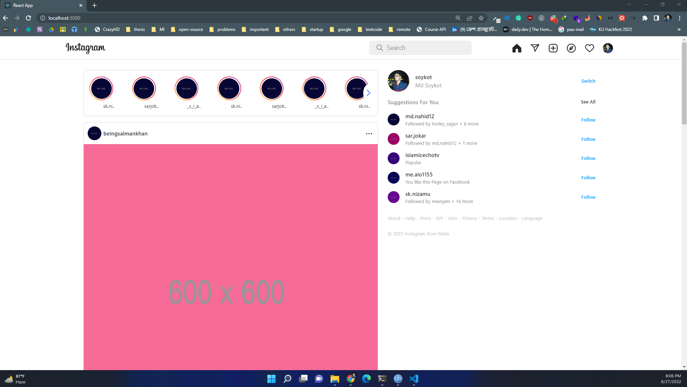

## Instagram home page clone

> Live demo [_here_](https://resonant-flan-76a375.netlify.app//)

#### Technologies Used
- React
- Bootstrap

#### Project installation
1. Clone Repository
```
$ git clone https://github.com/soykot2910/instagram-clone-assessment
$ cd instagram-clone-assessment
```
2. Install dependencies

```
$ npm i
```
3. Run Project
```
$ npm start
```